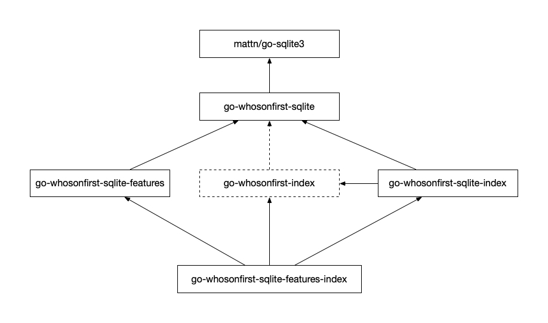

# go-whosonfirst-sqlite

Go package for working with SQLite databases.

## Install

You will need to have both `Go` (specifically a version of Go more recent than 1.6 so let's just assume you need [Go 1.8](https://golang.org/dl/) or higher) and the `make` programs installed on your computer. Assuming you do just type:

```
make bin
```

All of this package's dependencies are bundled with the code in the `vendor` directory.

## Example

### Simple

```
import (
	"github.com/whosonfirst/go-whosonfirst-geojson-v2/feature"
	"github.com/acaloiaro/go-whosonfirst-sqlite/database"
	"github.com/acaloiaro/go-whosonfirst-sqlite-features/tables"
)

func main (){

	db, _ := database.NewDB("wof.db")
	defer db.Close()

	# Or you could just invoke these two calls with the handy:
	# st, _ := tables.NewSPRTableWithDatabase(db)

	st, _ := features.NewSPRTable()
	st.InitializeTable(db)

	f, _ := feature.LoadWOFFeatureFromFile("123.geojson")
	st.IndexFeature(db, f)
}
```

_Error handling has been removed for the sake of brevity._

## Tables

_If you're looking for all the tables related to Who's On First documents they've been moved in to the [go-whosonfirst-sqlite-features](https://github.com/acaloiaro/go-whosonfirst-sqlite-features) package._

## Custom tables

Sure. You just need to write a per-table package that implements the `Table` interface, described below. For examples, consult the `tables` directories in the [go-whosonfirst-sqlite-features](https://github.com/acaloiaro/go-whosonfirst-sqlite-features) or [go-whosonfirst-sqlite-brands](https://github.com/whosonfirst/go-whosonfirst-sqlite-brands) packages.

## DSN strings

### :memory:

To account for [this issue](https://github.com/mattn/go-sqlite3/issues/204) DSN strings that are `:memory:` will be rewritten as:

`file::memory:?mode=memory&cache=shared`

### things that don't start with `file:`

To account for [this issue](https://github.com/mattn/go-sqlite3/issues/39) DSN strings that are _not_ `:memory:` and _don't_ start with `:file:` will be rewritten as:

`file:{DSN}?cache=shared&mode=rwc`

## Interfaces

### Database

```
type Database interface {
     Conn() (*sql.DB, error)
     DSN() string
     Close() error
}
```

### Table

```
type Table interface {
     Name() string
     Schema() string
     InitializeTable(Database) error
     IndexRecord(Database, interface{}) error
}
```

It is left up to people implementing the `Table` interface to figure out what to do with the second value passed to the `IndexRecord` method. For example:

```
func (t *BrandsTable) IndexRecord(db sqlite.Database, i interface{}) error {
	return t.IndexBrand(db, i.(brands.Brand))
}

func (t *BrandsTable) IndexBrand(db sqlite.Database, b brands.Brand) error {
	// code to index brands.Brands here
}
```

## Dependencies and relationships

If you look around the `whosonfirst` organization you'll notice there are a bunch of `go-whosonfirst-sqlite-*` packages. Specifically:

* https://github.com/acaloiaro/go-whosonfirst-sqlite
* https://github.com/acaloiaro/go-whosonfirst-sqlite-index
* https://github.com/acaloiaro/go-whosonfirst-sqlite-features
* https://github.com/acaloiaro/go-whosonfirst-sqlite-features-index

The first two are meant to be generic and broadly applicable to any SQLite database. The last two are specific to Who's On First documents.

And then there's this which is relevant because it needs to _index_ databases that have been created using the packages above:

* https://github.com/whosonfirst/go-whosonfirst-index

The relationship / dependency-chain for these five packages looks like this:



## See also

* https://sqlite.org/
* https://github.com/mattn/go-sqlite3